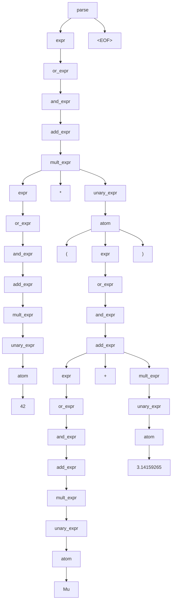
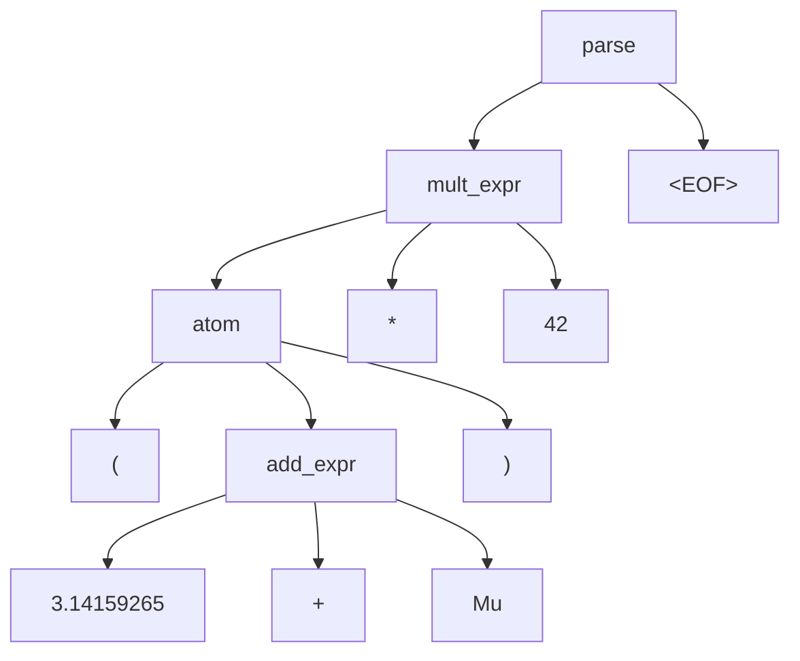
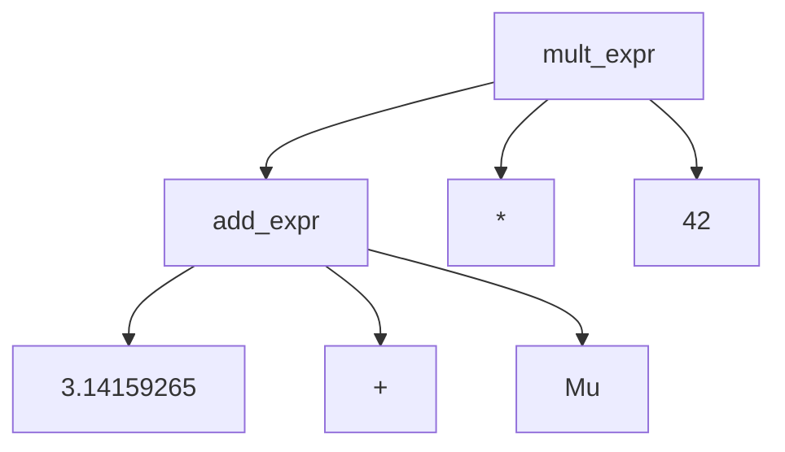
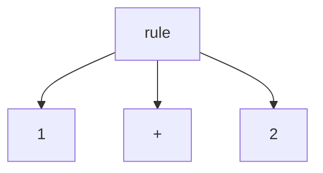
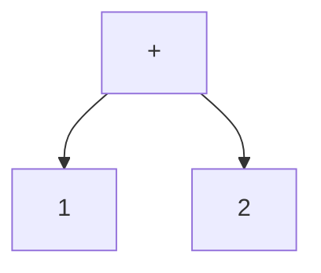
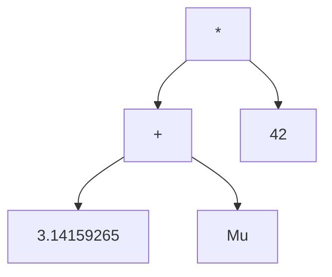
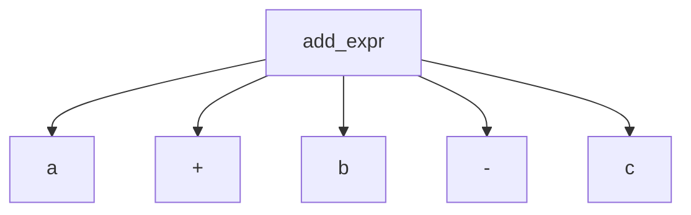
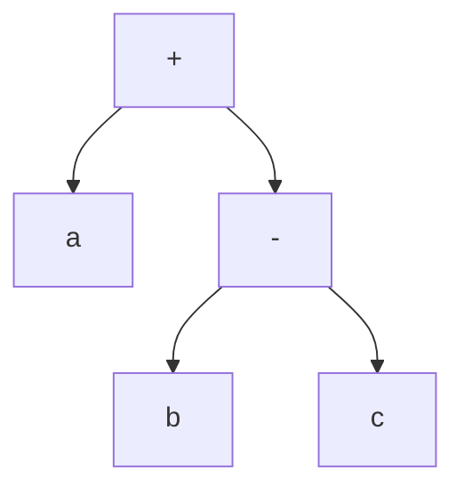

## ANTLR tree rewriter

Version 4 of ANTLR produces parse trees (contrary to abstract syntax trees). 
Depending on how your grammar is written, this can cause the parse tree to 
become large. This library might help compact the parse tree and adds the 
possibility to serialize the parse tree to JSON (and the other way around).

### TOC

 - [Install](#install)
 - [Example](#example)
 - [Flattened tree](#flattened-tree)
 - [Ignoring tokens](#ignoring-tokens)
 - [Promoting tokens](#promoting-tokens)
 - [JSON](#json)

### Install

NuGet:

```xml
<PackageReference Include="AntlrTreeRewriter" Version="1.0.6" />
```

### Example

Given the following ANTLR grammar:

```antlr
grammar Expr;

parse
 : expr EOF
 ;

expr
 : or_expr
 ;

or_expr
 : and_expr ('||' expr)?
 ;

and_expr
 : add_expr ('&&' expr)?
 ;

add_expr
 : mult_expr (('+' | '-') expr)?
 ;

mult_expr
 : unary_expr (('*' | '/' | '%') expr)?
 ;

unary_expr
 : '-' atom
 | atom
 ;

atom
 : '(' expr ')'
 | ID
 | NUM
 ;

ADD  : '+';
MIN  : '-';
MUL  : '*';
DIV  : '/';
MOD  : '%';
AND  : '&&';
OR   : '||';
OPAR : '(';
CPAR : ')';
ID   : [a-zA-Z_] [a-zA-Z_0-9]*;
NUM  : [0-9]+ ('.' [0-9]+)?;
WS   : [ \t\r\n]+ -> skip;
```

If you now generate a parser and parse the input `(3.14159265 + Mu) * 42`
ANTLR will give you the following parse tree:



### Flattened tree

This library can be used to "flatten" the generated parse tree as follows:

```java
var source = "(3.14159265 + Mu) * 42";
var lexer = new ExprLexer(CharStreams.fromString(source));
var parser = new ExprParser(new CommonTokenStream(lexer));
var root = parser.parse();

var node = new TreeRewriter(root).rewrite();
```

and `node` will now represent the following tree:



### Ignoring tokens

If you want to ignore certain tokens, like `(`, `)`, and `EOF` for example,
you can do the following:

```cs
var source = "(3.14159265 + Mu) * 42";
var lexer = new ExprLexer(CharStreams.fromString(source));
var parser = new ExprParser(new CommonTokenStream(lexer));
var root = parser.parse();

var node = new TreeRewriter(root)
  .Ignore(ExprLexer.Eof, ExprLexer.OPAR, ExprLexer.CPAR)
  .Rewrite();
```

and now `node` will represent the following tree:



### Promoting tokens

When you want to "promote" certain tokens, for example if you want 
to rewrite:



into:



you can do the following:

```cs
var source = "(3.14159265 + Mu) * 42";
var lexer = new ExprLexer(CharStreams.fromString(source));
var parser = new ExprParser(new CommonTokenStream(lexer));
var root = parser.parse();

var node = new TreeRewriter(root)
  .Ignore(ExprLexer.Eof, ExprLexer.OPAR, ExprLexer.CPAR)
  .Promote(ExprLexer.ADD, ExprLexer.MIN, ExprLexer.MUL, ExprLexer.DIV, ExprLexer.MOD, ExprLexer.AND, ExprLexer.OR)
  .Rewrite();
```

which will result in `node` looking likt this:



Note that if your parse tree can produce the following:



and you do promote both the `+` and `-` tokens:

```cs
var node = new TreeRewriter(root)
  .Promote(ExprLexer.ADD, ExprLexer.MIN)
  .Rewrite();
```

then the first token that is encountered (`+` in this case) will become 
the promoted token:



### JSON

The `TreeNode` class can be easily used to (de) serialize from and to
JSON:

```cs
[Fact]
public void JsonDemo()
{
  var source = "(3.14159265 + Mu) * 42";

  var lexer = new ExprLexer(CharStreams.fromString(source));
  var parser = new ExprParser(new CommonTokenStream(lexer));
  var root = parser.parse();

  var node = new TreeRewriter(root)
    .Ignore(ExprLexer.Eof, ExprLexer.OPAR, ExprLexer.CPAR)
    .Promote(ExprLexer.ADD, ExprLexer.MIN, ExprLexer.MUL, ExprLexer.DIV, ExprLexer.MOD, ExprLexer.AND, ExprLexer.OR)
    .Rewrite();
  
  var json = JsonConvert.SerializeObject(node);

  Assert.Equal("{\"Label\":\"*\",\"TokenType\":3,\"Line\":1,\"StartIndex\":18,\"StopIndex\":18,\"Children\":[{\"Label\":\"+\",\"TokenType\":1,\"Line\":1,\"StartIndex\":12,\"StopIndex\":12,\"Children\":[{\"Label\":\"3.14159265\",\"TokenType\":11,\"Line\":1,\"StartIndex\":1,\"StopIndex\":10,\"Children\":[]},{\"Label\":\"Mu\",\"TokenType\":10,\"Line\":1,\"StartIndex\":14,\"StopIndex\":15,\"Children\":[]}]},{\"Label\":\"42\",\"TokenType\":11,\"Line\":1,\"StartIndex\":20,\"StopIndex\":21,\"Children\":[]}]}", json);

  var deserializedNode = JsonConvert.DeserializeObject<TreeNode>(json);

  Assert.Equal("*", deserializedNode.Label);
  Assert.Equal("+", deserializedNode.Children[0].Label);
  Assert.Equal("3.14159265", deserializedNode.Children[0].Children[0].Label);
  Assert.Equal("Mu", deserializedNode.Children[0].Children[1].Label);
  Assert.Equal("42", deserializedNode.Children[1].Label);
}
```